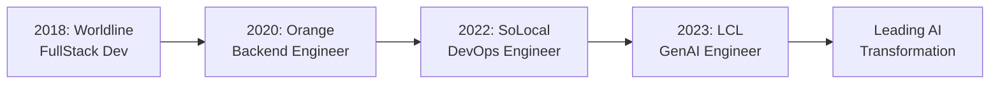

<div align="center">
  
# 🚀 Omar EL HACHIMI

### Generative AI Engineer | AI Governance Specialist | Cloud & DevOps Expert

[](https://www.linkedin.com/in/omar-el-hachimi-b48286158/)
[](mailto:oelhachi@gmail.com)
[](https://github.com/OM-EL)

</div>

---

## 👨‍💻 About Me

```python
class GenerativeAIEngineer:
    def __init__(self):
        self.name = "Omar EL HACHIMI"
        self.role = "Generative AI Engineer"
        self.location = "Paris, France 🇫🇷"
        self.current_company = "Crédit Lyonnais (LCL)"
        self.focus_areas = [
            "Generative AI Platform Architecture",
            "RAG Implementation & Optimization",
            "AI Governance & Compliance (EU AI ACT)",
            "Cloud-Native AI Solutions",
            "DevSecOps & MLOps"
        ]
        
    def say_hi(self):
        print("Building the future of enterprise AI, one model at a time! 🤖")

me = GenerativeAIEngineer()
me.say_hi()
```

🔭 **Currently:** Leading the AI4IT initiative at LCL, architecting and deploying a sovereign GenAI platform supporting 90+ internal teams

🌱 **Learning:** Advanced RAG techniques, AI Security frameworks, and cutting-edge LLM orchestration patterns

💡 **Passionate about:** Building scalable AI systems, AI governance, and democratizing AI through secure, self-service platforms

---

## 🎯 What I Do

<table>
<tr>
<td width="50%">

### 🤖 Generative AI & LLMs
- **Platform Engineering**: Custom GPT platforms & RAG systems
- **LLM Orchestration**: LangChain, LlamaIndex, CrewAI
- **Vector Databases**: ChromaDB, Colpali integration
- **Observability**: Langsmith, Langfuse, Helicone
- **Guardrails & Safety**: Implementation of AI safety measures
- **Model Integration**: OpenAI, AWS Bedrock, Vertex AI, Gemini

</td>
<td width="50%">

### ☁️ Cloud & DevOps
- **Cloud Platforms**: AWS, GCP, Azure multi-cloud
- **Container Orchestration**: Kubernetes (CKA certified)
- **CI/CD**: GitLab, ArgoCD, Jenkins
- **IaC**: Terraform, Kustomize
- **Monitoring**: Prometheus, Dynatrace, Grafana
- **Security**: HashiCorp Vault, OPA, AppArmor

</td>
</tr>
</table>

---

## 🏆 Certifications & Credentials

<div align="center">


</div>

---

## 💼 Featured Projects & Achievements

### 🏦 Enterprise GenAI Platform @ LCL (2023-Present)
> **Building a sovereign AI platform serving 90+ teams**

- 🎯 **Architecture & Leadership**: Designed and deployed a custom "GPTs-like" platform enabling self-service chatbot creation
- 🔒 **Security & Governance**: Implemented RBAC, API quotas, budget tracking, and EU AI ACT compliance
- 🚀 **Use Cases Delivered**: 
  - RAG systems for Confluence/Jira integration
  - Text-to-SQL assistants
  - DevOps helpers (K8sGPT, manifest review)
  - CVE vulnerability assistance
- 📊 **Impact**: Drove GitHub Copilot adoption, conducted ROI analysis, and led technical workshops
- 🧪 **Quality Assurance**: Load testing, DeepEval, Ragas for RAG evaluation

### 🛠️ Tech Stack Highlights

<details>
<summary><b>🤖 Generative AI & MLOps</b></summary>
<br>


**Frameworks & Tools**: LlamaIndex • CrewAI • Litellm • ChromaDB • Langsmith • Langfuse • Helicone • Guardrails • Colpali • DeepEval • Ragas

</details>

<details>
<summary><b>☁️ Cloud & Infrastructure</b></summary>
<br>


**DevOps Tools**: ArgoCD • GitLab CI/CD • Jenkins • Prometheus • Grafana • Dynatrace • HashiCorp Vault • Kustomize

</details>

<details>
<summary><b>💻 Development & Languages</b></summary>
<br>


**Backend**: Spring Batch • REST APIs • RabbitMQ • Maven • Microservices Architecture

</details>

<details>
<summary><b>🔒 Security & Compliance</b></summary>
<br>


**Tools**: KubeSec • AppArmor • Seccomp • Gvisor • AWS X-Ray • CIS Benchmarks • OPA • Vulnerability Assessment • SAST/DAST

</details>

---

## 📊 GitHub Stats

<div align="center">
  
  
</div>

<div align="center">
  
</div>

---

## 🌟 Career Highlights



### 💡 Key Achievements

- 🏗️ **Architected** a sovereign GenAI platform from scratch, supporting 90+ teams
- 🚀 **Deployed** multiple production RAG systems with custom integrations (Confluence, Jira)
- 📈 **Drove** GitHub Copilot adoption through technical workshops and ROI analysis
- 🔒 **Implemented** comprehensive AI governance framework aligned with EU AI ACT
- ⚡ **Optimized** cloud infrastructure reducing costs by implementing strategic API quotas
- 🎯 **Mentored** teams on AI best practices, prompt engineering, and LLM orchestration
- 🔧 **Migrated** critical applications to cloud-native architecture (Orange)
- 📊 **Built** ETL pipelines and data lakes for analytics (Worldline, SoLocal)

---

## 🎓 Education

**🎓 Polytech Tours** - Systems Engineering (2019)  
**📐 Classes Préparatoires** - Mathematics (2016)  
**🏆 Baccalauréat** - Mathematics with Honors

---

## 💬 Let's Connect!

<div align="center">

**I'm always interested in collaborating on:**
- 🤖 Generative AI projects and RAG implementations
- ☁️ Cloud-native architectures and DevOps best practices
- 🔒 AI Security and Governance frameworks
- 🚀 Innovative AI use cases in enterprise settings

**📫 Reach out to me:**
- 📧 Email: oelhachi@gmail.com
- 💼 LinkedIn: [Omar EL HACHIMI](https://www.linkedin.com/in/omar-el-hachimi-b48286158/)
- 📍 Location: Paris, France

---


</div>
