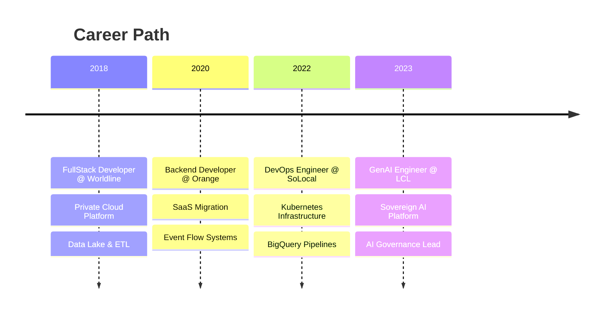

<!-- ANIMATED HEADER -->


<!-- SOCIAL BADGES -->
<div align="center">
  
  [](https://git.io/typing-svg)
  
  <br/>
  
  <a href="https://github.com/OM-EL?tab=followers">
    
  </a>
  <a href="https://github.com/OM-EL?tab=repositories&sort=stargazers">
    
  </a>
  
  
</div>

<br/>

<!-- ABOUT ME SECTION -->


##  **About Me**

```python
class OmarElHachimi:
    def __init__(self):
        self.role = "Generative AI Engineer"
        self.location = "Paris, France 🇫🇷"
        self.company = "LCL - Crédit Lyonnais"
        self.languages = ["Python", "Java", "Solidity"]
        self.daily_tools = ["LangChain", "Kubernetes", "AWS"]
        
    def current_mission(self):
        return """
        🎯 Building a sovereign GenAI platform
        🤖 Orchestrating AI agents at scale
        🔐 Implementing AI governance (EU AI Act)
        """
    
    def fun_fact(self):
        return "I secure K8s clusters before my ☕ gets cold"
```

<br clear="both"/>

---

<!-- SNAKE ANIMATION -->
<div align="center">
  <h2>🐍 My Contributions</h2>
  <br>
  
</div>

---

<!-- GITHUB STATS -->
<h2 align="center">📊 GitHub Analytics</h2>

<p align="center">
  <a href="https://github.com/OM-EL">
    
    
  </a>
</p>

<p align="center">
  
</p>

<!-- TROPHIES -->
<p align="center">
  <a href="https://github.com/ryo-ma/github-profile-trophy">
    
  </a>
</p>

---

<!-- TECH STACK -->
<h2 align="center">🛠️ Tech Arsenal</h2>

<details open>
<summary><b>🧠 Generative AI & LLMs</b></summary>
<br/>
<p align="center">
  
  
  
  
  
  
</p>
<p align="center">
  <code>CrewAI</code> • <code>Litellm</code> • <code>Ollama</code> • <code>Langsmith</code> • <code>ChromaDB</code> • <code>RAG</code> • <code>Guardrails</code>
</p>
</details>

<details open>
<summary><b>☁️ Cloud & DevOps</b></summary>
<br/>
<p align="center">
  
  
  
  
  
  
  
</p>
</details>

<details open>
<summary><b>🛡️ Security & Blockchain</b></summary>
<br/>
<p align="center">
  
  
  
  
</p>
</details>

<details open>
<summary><b>💻 Languages & Backend</b></summary>
<br/>
<p align="center">
  
  
  
  
</p>
</details>

---

<!-- EXPERIENCE TIMELINE -->
<h2 align="center">💼 Experience Journey</h2>



<table align="center">
<tr>
<td align="center" width="25%">

<br/><br/>
<b>🤖 GenAI Engineer</b>
<br/>
<sub>Crédit Lyonnais (LCL)</sub>
<br/><br/>
<code>Sovereign RAG Platform</code>
<br/>
<code>AI Governance</code>
<br/>
<code>GitHub Copilot Lead</code>
</td>
<td align="center" width="25%">

<br/><br/>
<b>⚙️ DevOps Engineer</b>
<br/>
<sub>SoLocal</sub>
<br/><br/>
<code>K8s Infrastructure</code>
<br/>
<code>BigQuery Pipelines</code>
<br/>
<code>CI/CD Automation</code>
</td>
<td align="center" width="25%">

<br/><br/>
<b>☕ Backend Developer</b>
<br/>
<sub>Orange</sub>
<br/><br/>
<code>SaaS Migration</code>
<br/>
<code>Event-Driven Systems</code>
<br/>
<code>DDD Architecture</code>
</td>
<td align="center" width="25%">

<br/><br/>
<b>🖥️ FullStack Developer</b>
<br/>
<sub>Worldline</sub>
<br/><br/>
<code>Private Cloud</code>
<br/>
<code>Data Engineering</code>
<br/>
<code>REST APIs</code>
</td>
</tr>
</table>

---

<!-- CERTIFICATIONS -->
<h2 align="center">🏆 Certifications</h2>

<p align="center">
  
  
  
</p>
<p align="center">
  
  
</p>
<p align="center">
  
  
  
</p>

---

<!-- EDUCATION -->
<h2 align="center">🎓 Education</h2>

<p align="center">
  
  <br/>
  
</p>

---

<!-- CONNECT -->
<h2 align="center">🤝 Let's Connect</h2>

<p align="center">
  <a href="mailto:oelhachi@gmail.com">
    
  </a>
  <a href="https://linkedin.com/in/omarelhachimi">
    
  </a>
  <a href="https://github.com/OM-EL">
    
  </a>
</p>

---

<!-- QUOTE -->
<div align="center">
  
</div>

---

<!-- ACTIVITY GRAPH -->
<p align="center">
  
</p>

<!-- FOOTER -->


