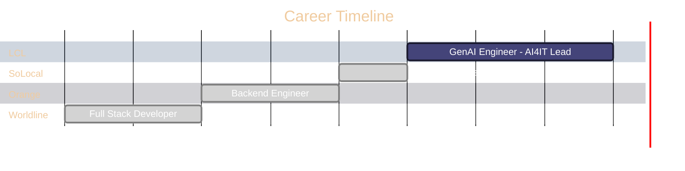

<div align="center">
  
<!-- HEADER WITH WAVE SVG -->


<!-- SOCIAL LINKS -->
<a href="https://www.linkedin.com/in/omar-el-hachimi-b48286158/">
  
</a>
<a href="mailto:oelhachi@gmail.com">
  
</a>
<a href="https://gen-report.duckdns.org/">
  
</a>

</div>

<br/>

<!-- ABOUT SECTION WITH PICTURE -->


## 🧬 The Story

```javascript
const omar = {
  role: "Generative AI Engineer",
  company: "Crédit Lyonnais (LCL)",
  mission: "Democratizing AI for 90+ teams",
  years_of_experience: 7,
  focus: [
    "Sovereign AI Platforms",
    "RAG Systems",
    "AI Governance",
    "EU AI ACT Compliance"
  ]
};
```

I believe **AI should empower, not complicate**. 

After 7 years building systems across fintech, telecom, and advertising, I lead the **AI4IT initiative** at **LCL** — architecting sovereign GenAI platforms that serve **90+ internal teams** while maintaining banking-grade security.

<br clear="right"/>

---

<!-- PROJECTS WITH VISUAL CARDS -->
## 🚀 What I'm Building

<table>
<tr>
<td width="50%">
<h3 align="center">🏦 Enterprise GenAI Platform</h3>
<div align="center">
  <a href="#">
    
  </a>
  
</div>
<br/>
<p><strong>Sovereign "Custom GPTs" for Banking</strong></p>
<p>Enabling any team to create AI assistants without code, while maintaining strict compliance.</p>

```yaml
capabilities:
  - RAG: Confluence, Jira, SharePoint
  - Text-to-SQL: Natural language queries
  - DevOps: K8sGPT, CVE automation
  - Compliance: EU AI ACT, RBAC
```

</td>
<td width="50%">
<h3 align="center">🎯 Kastor.AI</h3>
<div align="center">
  <a href="https://gen-report.duckdns.org/">
    
  </a>
  <a href="https://gen-report.duckdns.org/">
    
  </a>
</div>
<br/>
<p><strong>AI-Powered Report Generation</strong></p>
<p>Upload your data → Get polished, professional reports in seconds.</p>

```yaml
features:
  - Smart: RAG-based analysis
  - Flexible: PDF, DOCX, HTML export
  - Branded: Custom templates
  - Secure: Enterprise-grade
```

<div align="center">
  <a href="https://gen-report.duckdns.org/">👉 <strong>Try the Live Demo</strong></a>
</div>

</td>
</tr>
</table>

---

<!-- CAREER JOURNEY - MERMAID DIAGRAM -->
## 📈 The Journey



<details>
<summary><strong>📍 Click to expand role details</strong></summary>
<br/>

| Period | Role | Company | Key Contributions |
|:------:|:-----|:--------|:------------------|
| **2023→** | **GenAI Engineer** | Crédit Lyonnais | Sovereign AI platform for 90+ teams, EU AI ACT compliance |
| 2022→23 | DevOps Engineer | SoLocal | K8s clusters, BigQuery pipelines, Terraform IaC |
| 2020→22 | Backend Engineer | Orange | Cloud migration, event-driven microservices |
| 2018→20 | Full Stack Dev | Worldline | ETL pipelines, financial reporting systems |

</details>

---

<!-- TECH STACK - VISUAL CATEGORIES -->
## 🛠️ Tech Stack

<details open>
<summary><strong>🤖 Generative AI & LLM</strong></summary>
<br/>
<p align="center">
  
  
  
  
  
  
</p>
</details>

<details>
<summary><strong>☁️ Cloud & DevOps</strong></summary>
<br/>
<p align="center">
  
  
  
  
  
  
</p>
</details>

<details>
<summary><strong>💻 Development</strong></summary>
<br/>
<p align="center">
  
  
  
  
  
</p>
</details>

<details>
<summary><strong>🔐 Security & Governance</strong></summary>
<br/>
<p align="center">
  
  
  
  
</p>
</details>

---

<!-- CERTIFICATIONS - VISUAL GRID -->
## 🏆 Certifications

<div align="center">

| Kubernetes | AWS | AI Governance |
|:----------:|:---:|:-------------:|
|  |  |  |
|  |  |  |

</div>

---

<!-- GITHUB STATS -->
## 📊 GitHub Analytics

<div align="center">
  
  
</div>

<div align="center">
  
</div>

---

<!-- FOOTER -->
<div align="center">

### 💬 Let's Connect

*Open to discussing **Enterprise AI**, **RAG architectures**, **AI Governance**, and **Cloud-Native Development***

<br/>

<a href="mailto:oelhachi@gmail.com">
  
</a>

<br/><br/>


</div>
