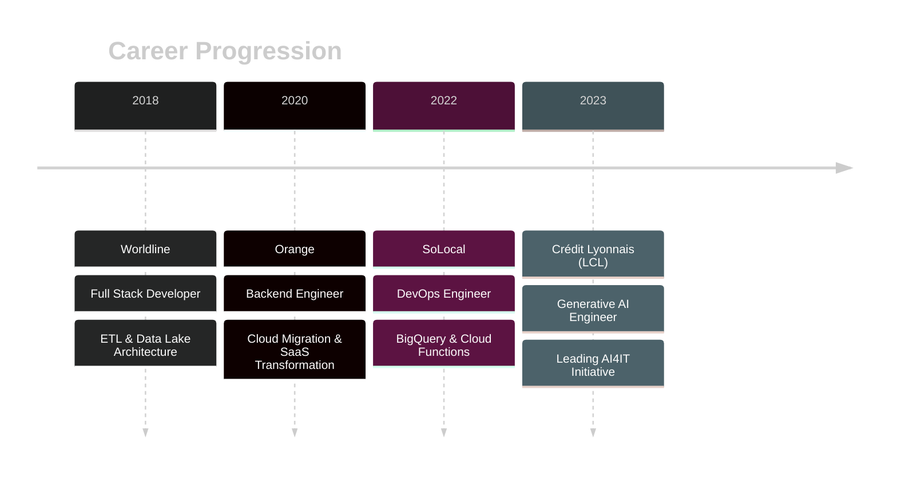
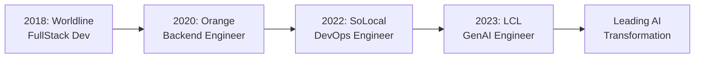

<div align="center">


<div align="center">
  
</div>

<p align="center">
  <a href="https://www.linkedin.com/in/omar-el-hachimi-b48286158/">
    
  </a>
  <a href="mailto:oelhachi@gmail.com">
    
  </a>
  <a href="https://gen-report.duckdns.org/">
    
  </a>
</p>

<p align="center">
  
  
  
</p>

</div>


<br>


##  About Me


```python
class OmarElHachimi:
    def __init__(self):
        self.username = "OM-EL"
        self.name = "Omar EL HACHIMI"
        self.role = "Generative AI Engineer"
        self.company = "Crédit Lyonnais (LCL)"
        self.location = "Paris, France 🇫🇷"
        self.passion = "Building Intelligent AI Systems"
        
    def get_current_focus(self):
        return {
            "🎯 Lead": "AI4IT Initiative @ LCL",
            "🏗️ Build": "Sovereign GenAI Platform",
            "👥 Support": "90+ Internal Teams",
            "🔒 Ensure": "AI Governance & EU AI ACT Compliance",
            "🚀 Deploy": "Production RAG Systems"
        }
    
    def get_expertise(self):
        return [
            "GenAI Platform Architecture",
            "RAG Implementation & Optimization", 
            "LLM Orchestration (LangChain, LlamaIndex, CrewAI)",
            "Cloud-Native Solutions (AWS, GCP, Azure)",
            "Kubernetes & Container Orchestration",
            "DevSecOps & MLOps Pipelines"
        ]
    
    def say_hello(self):
        print("Building the future of enterprise AI, one model at a time! 🤖")

me = OmarElHachimi()
me.say_hello()
```

<br>

<details>
<summary><b>� Professional Journey</b></summary>
<br>



</details>

---


##  Tech Arsenal

<div align="center">

### 🤖 Generative AI & LLM Stack
<p>


</p>

### ☁️ Cloud & DevOps
<p>


</p>

### 💻 Programming & Frameworks
<p>


</p>

### 🛡️ Security & Monitoring
<p>


</p>

### 🗄️ Databases & Tools
<p>


</p>

</div>

---

## 🏆 Certifications & Credentials

<div align="center">


</div>

---

## 💼 Featured Projects & Achievements

### � Kastor.AI - AI-Powered Report Generation Platform
> **Intelligent document generation and analysis platform**

[](https://gen-report.duckdns.org/)
[](https://gen-report.duckdns.org/)

**Kastor.AI** is a cutting-edge generative AI platform designed for automated report generation and intelligent document processing. The platform leverages state-of-the-art LLMs and RAG technology to transform data into comprehensive, professional reports.

**🌟 Key Features:**
- 📝 **Automated Report Generation**: Transform raw data into polished, professional reports
- 🤖 **AI-Powered Analysis**: Deep document understanding and intelligent content synthesis
- 🎯 **Custom Templates**: Flexible report formatting and branding options
- 🔒 **Secure Processing**: Enterprise-grade security and data protection
- ⚡ **Real-time Generation**: Fast, efficient document processing pipeline

**🛠️ Tech Stack:**
- LLM Integration & Prompt Engineering
- RAG Architecture for context-aware generation
- Modern web application framework
- Cloud deployment with DuckDNS

**🔗 [Try Kastor.AI →](https://gen-report.duckdns.org/)**

---

### �🏦 Enterprise GenAI Platform @ LCL (2023-Present)
> **Building a sovereign AI platform serving 90+ teams**

- 🎯 **Architecture & Leadership**: Designed and deployed a custom "GPTs-like" platform enabling self-service chatbot creation
- 🔒 **Security & Governance**: Implemented RBAC, API quotas, budget tracking, and EU AI ACT compliance
- 🚀 **Use Cases Delivered**: 
  - RAG systems for Confluence/Jira integration
  - Text-to-SQL assistants
  - DevOps helpers (K8sGPT, manifest review)
  - CVE vulnerability assistance
- 📊 **Impact**: Drove GitHub Copilot adoption, conducted ROI analysis, and led technical workshops
- 🧪 **Quality Assurance**: Load testing, DeepEval, Ragas for RAG evaluation

### 🛠️ Tech Stack Highlights

<details>
<summary><b>🤖 Generative AI & MLOps</b></summary>
<br>


**Frameworks & Tools**: LlamaIndex • CrewAI • Litellm • ChromaDB • Langsmith • Langfuse • Helicone • Guardrails • Colpali • DeepEval • Ragas

</details>

<details>
<summary><b>☁️ Cloud & Infrastructure</b></summary>
<br>


**DevOps Tools**: ArgoCD • GitLab CI/CD • Jenkins • Prometheus • Grafana • Dynatrace • HashiCorp Vault • Kustomize

</details>

<details>
<summary><b>💻 Development & Languages</b></summary>
<br>


**Backend**: Spring Batch • REST APIs • RabbitMQ • Maven • Microservices Architecture

</details>

<details>
<summary><b>🔒 Security & Compliance</b></summary>
<br>


**Tools**: KubeSec • AppArmor • Seccomp • Gvisor • AWS X-Ray • CIS Benchmarks • OPA • Vulnerability Assessment • SAST/DAST

</details>

---

## 📊 GitHub Stats

<div align="center">
  
  
</div>

<div align="center">
  
</div>

---

## 🌟 Career Highlights



### 💡 Key Achievements

- 🏗️ **Architected** a sovereign GenAI platform from scratch, supporting 90+ teams
- 🚀 **Deployed** multiple production RAG systems with custom integrations (Confluence, Jira)
- 📈 **Drove** GitHub Copilot adoption through technical workshops and ROI analysis
- 🔒 **Implemented** comprehensive AI governance framework aligned with EU AI ACT
- ⚡ **Optimized** cloud infrastructure reducing costs by implementing strategic API quotas
- 🎯 **Mentored** teams on AI best practices, prompt engineering, and LLM orchestration
- 🔧 **Migrated** critical applications to cloud-native architecture (Orange)
- 📊 **Built** ETL pipelines and data lakes for analytics (Worldline, SoLocal)

---

## 🎓 Education

**🎓 Polytech Tours** - Systems Engineering (2019)  
**📐 Classes Préparatoires** - Mathematics (2016)  
**🏆 Baccalauréat** - Mathematics with Honors

---

## 💬 Let's Connect!

<div align="center">

**I'm always interested in collaborating on:**
- 🤖 Generative AI projects and RAG implementations
- ☁️ Cloud-native architectures and DevOps best practices
- 🔒 AI Security and Governance frameworks
- 🚀 Innovative AI use cases in enterprise settings

**📫 Reach out to me:**
- 📧 Email: oelhachi@gmail.com
- 💼 LinkedIn: [Omar EL HACHIMI](https://www.linkedin.com/in/omar-el-hachimi-b48286158/)
- 📍 Location: Paris, France

---


</div>
