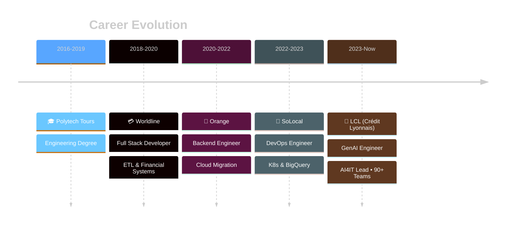

<!-- ═══════════════════════════════════════════════════════════════════════════
     🚀 OMAR EL HACHIMI - GENERATIVE AI ENGINEER
     ═══════════════════════════════════════════════════════════════════════════ -->

<div align="center">

<!-- ANIMATED WAVE HEADER -->


<!-- ANIMATED TYPING SVG - Multiple Roles -->
<a href="https://github.com/OM-EL">
  
</a>

<!-- PROFILE VIEWS + SOCIAL BADGES -->
<br/>
<p>
  
  
</p>

<!-- QUICK LINKS -->
<p>
  <a href="https://www.linkedin.com/in/omar-el-hachimi-b48286158/">
    
  </a>
  <a href="mailto:oelhachi@gmail.com">
    
  </a>
  <a href="https://gen-report.duckdns.org/">
    
  </a>
</p>

</div>

<!-- ═══════════════════════════════════════════════════════════════════════════
     🐍 CONTRIBUTION SNAKE ANIMATION
     ═══════════════════════════════════════════════════════════════════════════ -->

<picture>
  <source media="(prefers-color-scheme: dark)" srcset="https://raw.githubusercontent.com/platane/snk/output/github-contribution-grid-snake-dark.svg" />
  <source media="(prefers-color-scheme: light)" srcset="https://raw.githubusercontent.com/platane/snk/output/github-contribution-grid-snake.svg" />
  
</picture>

<!-- ═══════════════════════════════════════════════════════════════════════════
     👤 ABOUT ME - COMPACT & IMPACTFUL
     ═══════════════════════════════════════════════════════════════════════════ -->

<br/>


## ⚡ About

```typescript
const omar: Engineer = {
  location: "Paris 🇫🇷",
  role: "Generative AI Engineer",
  company: "Crédit Lyonnais (LCL)",
  experience: "7+ years",
  
  currentMission: {
    name: "AI4IT Initiative",
    impact: "90+ internal teams",
    focus: "Sovereign GenAI Platform"
  },
  
  expertise: [
    "RAG & Vector Databases",
    "LLM Orchestration",
    "AI Governance (EU AI ACT)",
    "Cloud-Native Architecture"
  ]
};
```

<br/>

> *"AI should empower, not complicate."*

I architect **sovereign AI platforms** that bring GenAI capabilities to **banking** while maintaining **regulatory compliance** and **enterprise-grade security**.

<br clear="both"/>

<!-- ═══════════════════════════════════════════════════════════════════════════
     🏆 GITHUB TROPHIES
     ═══════════════════════════════════════════════════════════════════════════ -->

<div align="center">
  
</div>

---

<!-- ═══════════════════════════════════════════════════════════════════════════
     🚀 FEATURED PROJECTS
     ═══════════════════════════════════════════════════════════════════════════ -->

## 🎯 Featured Projects

<div align="center">
<table>
<tr>
<td width="50%" valign="top">

### 🏦 AI4IT Platform
<p align="center">
  
  
</p>

**Enterprise GenAI for Banking**

✦ Custom GPT Builder (no-code)  
✦ RAG: Confluence, Jira, SharePoint  
✦ Text-to-SQL Dashboards  
✦ K8sGPT & CVE Automation  
✦ EU AI ACT Compliant  

<p align="center">
  
</p>

</td>
<td width="50%" valign="top">

### 🎨 Kastor.AI
<p align="center">
  <a href="https://gen-report.duckdns.org/">
    
  </a>
</p>

**AI Report Generator**

✦ Upload data → Get reports  
✦ RAG-powered analysis  
✦ PDF, DOCX, HTML export  
✦ Custom branding  
✦ Enterprise-grade security  

<p align="center">
  
</p>

<p align="center">
  <a href="https://gen-report.duckdns.org/"><b>👉 Try the Demo</b></a>
</p>

</td>
</tr>
</table>
</div>

---

<!-- ═══════════════════════════════════════════════════════════════════════════
     📊 CAREER JOURNEY - TIMELINE
     ═══════════════════════════════════════════════════════════════════════════ -->

## 📈 Journey



---

<!-- ═══════════════════════════════════════════════════════════════════════════
     🛠️ TECH STACK - SKILL ICONS
     ═══════════════════════════════════════════════════════════════════════════ -->

## 🛠️ Tech Stack

<div align="center">

### 🤖 AI & Machine Learning
<p>
  
  <br/>
  
  
  
  
  
</p>

### ☁️ Cloud & Infrastructure
<p>
  
</p>

### 💻 Development
<p>
  
</p>

### 🔐 Security & Governance
<p>
  
  
  
  
</p>

</div>

---

<!-- ═══════════════════════════════════════════════════════════════════════════
     🏅 CERTIFICATIONS
     ═══════════════════════════════════════════════════════════════════════════ -->

## 🏅 Certifications

<div align="center">
<p>
  
  
</p>
<p>
  
  
</p>
<p>
  
  
  
</p>
</div>

---

<!-- ═══════════════════════════════════════════════════════════════════════════
     📊 GITHUB STATISTICS DASHBOARD
     ═══════════════════════════════════════════════════════════════════════════ -->

## 📊 GitHub Stats

<div align="center">

<!-- Stats Cards Row -->
<p>
  
  
</p>

<!-- Languages Card -->


<!-- Activity Graph -->


</div>

---

<!-- ═══════════════════════════════════════════════════════════════════════════
     💬 CONNECT
     ═══════════════════════════════════════════════════════════════════════════ -->

<div align="center">

## 💬 Let's Connect


<br/><br/>

**Open to discussing Enterprise AI • RAG Architectures • AI Governance • Cloud-Native**

<br/>

<a href="https://www.linkedin.com/in/omar-el-hachimi-b48286158/">
  
</a>
<a href="mailto:oelhachi@gmail.com">
  
</a>

<br/><br/>

<!-- FOOTER WAVE -->


<sub>⭐ From <a href="https://github.com/OM-EL">OM-EL</a> with 💙</sub>

</div>
